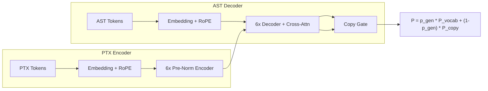

# DeepPTX — Neural PTX Decompiler

A **neuro-symbolic system** that decompiles NVIDIA PTX assembly back into clean, readable CUDA C++ code. Built with a Pointer-Generator Transformer, curriculum learning, and tree-constrained decoding.

## Architecture



- **Encoder:** PTX token sequence → contextualized memory (RoPE, 6 layers).
- **Decoder:** Autoregressive AST generation with cross-attention over PTX.
- **Pointer-Generator:** Copy mechanism so the model can emit register names and literals from the PTX input.

## Project layout

| Path | Description |
|------|-------------|
| `ptx_decompiler/data/` | 7-tier grammar, AST nodes, CUDA renderer, nvcc compiler wrapper, PTX normalizer, Dataset |
| `ptx_decompiler/tokenizer/` | Word-level PTX tokenizer, fixed AST S-expression tokenizer |
| `ptx_decompiler/model/` | Encoder, Decoder, RoPE, CopyGenerator, full decompiler model (~10M params) |
| `ptx_decompiler/training/` | Trainer, curriculum, cosine LR, exact match / tree edit / compile metrics |
| `ptx_decompiler/inference/` | Tree-constrained beam search, nvcc verifier, end-to-end pipeline |
| `ptx_decompiler/visualization/` | Cross-attention heatmaps, Graphviz AST tree |
| `notebooks/` | 01 data generation, 02 training, 03 evaluation, 04 Gradio demo |
| `demo/app.py` | Gradio UI: PTX → AST → CUDA, compilation badge |

## Setup

1. **Environment (e.g. Colab or local with CUDA):**
   ```bash
   pip install -r requirements.txt
   ```
   For data generation and compilation you need `nvcc` (CUDA Toolkit).

2. **Generate data (Free Colab):**
   - Open `notebooks/01_data_generation.ipynb`.
   - Run all cells to produce `dataset_100k.parquet` (100k+ PTX/AST/CUDA triples).

3. **Train (Colab Pro, A100):**
   - Open `notebooks/02_training.ipynb`.
   - Point `DATA_PATH` to your Parquet and run training (curriculum over 7 tiers).

4. **Evaluate & demo:**
   - `notebooks/03_evaluation.ipynb` — exact match, tree edit similarity, compilation rate, per-tier stats.
   - `notebooks/04_demo.ipynb` or `python demo/app.py` — Gradio app.

## Example

**Input (normalized PTX):**
```
ld.global.f32 %f0 [%r0] add.f32 %f1 %f0 %f2 st.global.f32 [%r2] %f1
```

**Output AST (S-expression):**
```
(ADD (MUL A B) C)
```

**Rendered CUDA:**
```cuda
extern "C" __global__ void k(float* A, float* B, float* C, float* X, float* Y, float* O, int N) {
    int i = blockIdx.x * blockDim.x + threadIdx.x;
    if (i < N) O[i] = (A[i] * B[i] + C[i]);
}
```

## Evaluation (4 axes)

| Metric | Description |
|--------|-------------|
| **Exact match** | Predicted AST string equals target AST. |
| **Tree edit similarity** | 1 − normalized token-level edit distance. |
| **Compilation success** | Decompiled CUDA compiles with `nvcc`. |
| **Semantic equivalence** | (Optional) Same numerical output as reference kernel. |

## License

MIT.
